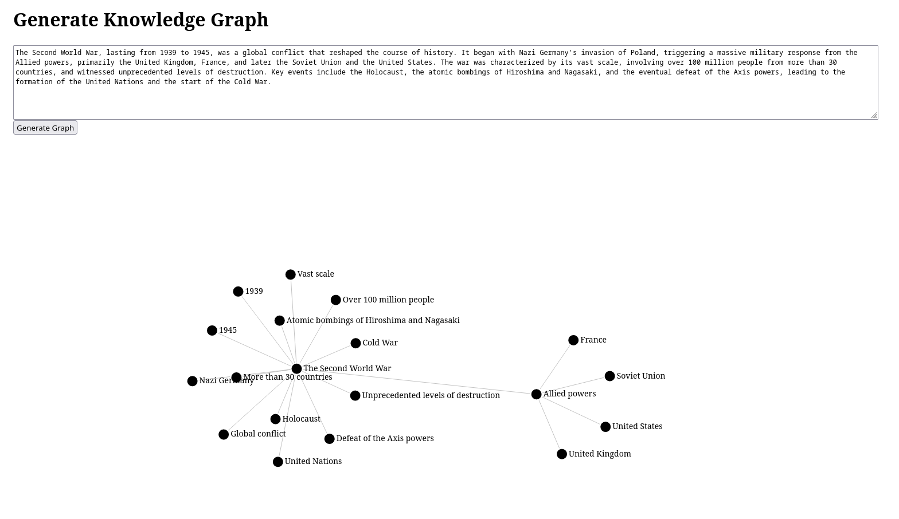

## Overview

This service enables users to convert unstructured text into structured knowledge graphs through a RESTful API. Users can register, authenticate, and interact with the service to create, save, and retrieve knowledge graphs, facilitating the extraction of meaningful insights from raw text.

*Example: knowledge graph for introduction text about Second World War*

### Features
- Text-to-Graph Conversion: Send unstructured text to a dedicated endpoint and receive a corresponding knowledge graph in JSON format.
- User Authentication: Secure user registration and login for personalized graph management.
- Graph Persistence: Save and retrieve generated knowledge graphs via API endpoints.

## How to use?
1. Clone the Repository: Start by cloning the repository to your local machine.
2. Install Dependencies: Ensure that .NET 7 is installed on your system, and obtain an API key from a supported LLM vendor (we recommend TogetherAI).
3. Configure the Application: Update the appsettings.json file with the necessary settings:

    - LLM Settings: Specify the LLM endpoint, API key, and model.
    - Database Configuration: Decide whether the service should cache data and if it should use MongoDB. Provide the connection string, database name, and collection name if MongoDB is used.

4. Run the Application: Execute the application using `dotnet run`. The primary interface for interacting with the application is Swagger. For convenience, a simple frontend is also available to display graphs. You can find more details [in the frontend guide](./extra/README.md).
5. Register or Log In: Create an account or log in using an email address and password.
6. Submit Text or Files: Use the `/knowledge-extraction/build-graph` endpoint to send plain text or the `/knowledge-extraction/upload-file` endpoint to upload a file. Both endpoints will generate and return a knowledge graph. If you're using the frontend, simply click the button to perform these actions.

## How is it built?
Take a look at [Documentation](./docs/README.md).