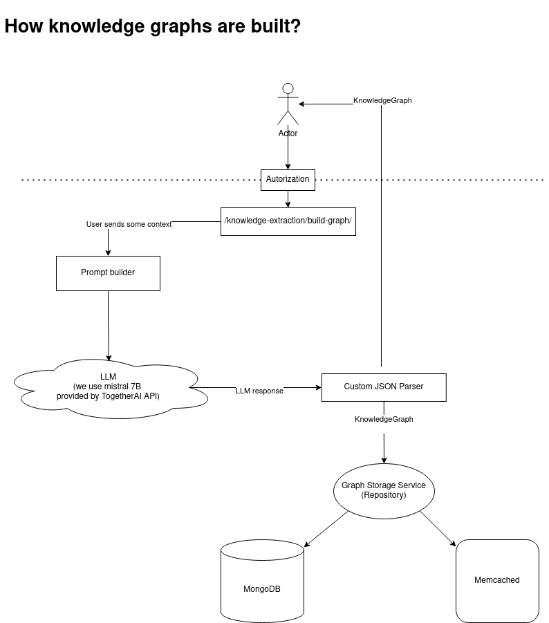

## Project structure 

```
/src - source code
    /Core - core logic
        /Domain - domain objects and interfaces
        /Logic - application logic
    /Data - everything that has to do with data storing: MongoDb and Memcached
    /Extensions
    /Utils
    /Infra
        /Services
        InfaDomain.cs
        Interfaces.cs
    /Web
        /Dtos - data transfer objects
        /Controllers - endpoints
        AppSettings.cs - CLI Mutable for `appsettings.json`
    Program.cs
/docs - technical documentation
/extra - additional materials. mainly "frontend" and how to run it
KnowledgeExtractionTool.csproj
appsettings.json
appsettings.Development.json
```

Generally, we tried to follow so-called Onion Architecture and Domain-Driven Design: start with underlying types and objects, then build around them and try to do this in a fashion that application logic doesn't interact with infrastracture, data and controllers. I hope we achieved this at least to some extent.

## How does it work?

### Authentication
Application has registration logic. Every user should be logged-in before it can access logic endpoints (ones which build knowledge graph). When user wants to register, he should use email and password. Then, this data is saved to the database (depending on the `DatabaseSettings` to Memcached and/or MongoDb collection). Of course, we hash the passwords. When he wants log in, he should enter this data again and (now, we acknowledge the following approach is unsecure. but it was the simplest one and security was not a core feature) application generates JWT token and saves it to cookies. Then, every time users access endpoints with `[Autorize]` attribute, we check for this JWT token in cookies and verify that some user indeed has such token (we store them in-memory). 

### Graph generation
To generate knowledge graphs, we use the following pipeline/architecture:


So, the logic is pretty simple:
1. Get context from a user. By "context" we understand any (unstructured) text.
2. We have prepared a template of prompt to generate knowledge graph. You can see it in `appsettings`. We then just insert this context to this template. This prompt asks to generate a knowledge graph with the specific JSON structure, so we can deserialize it.
3. Send the generated prompt to LLM. And get the response.
4. Then, we do *custom* deserialization (meaning, we don't use any `Json.Deserialize(string)` methods, but rather do it by hand). That's a debatable decision. The reason behind this is that we can't trust that LLM will return a strictly accurate output. Despite it missing a comma, bracket or other detail, it still can have a meaningful information, so we don't want to crash the request.
5. The resulting KnowledgeGraph we return to the user (in form of `KnowledgeGraphDto`) and save to database as well.

### Data
As already mentioned, we use both Memcached, and MongoDB. We use our own implementation of Memcached. Every time application wants to retrieve some user, graph, or context, it first checks the cache, and only then tries to get it from the MongoDb collection. 